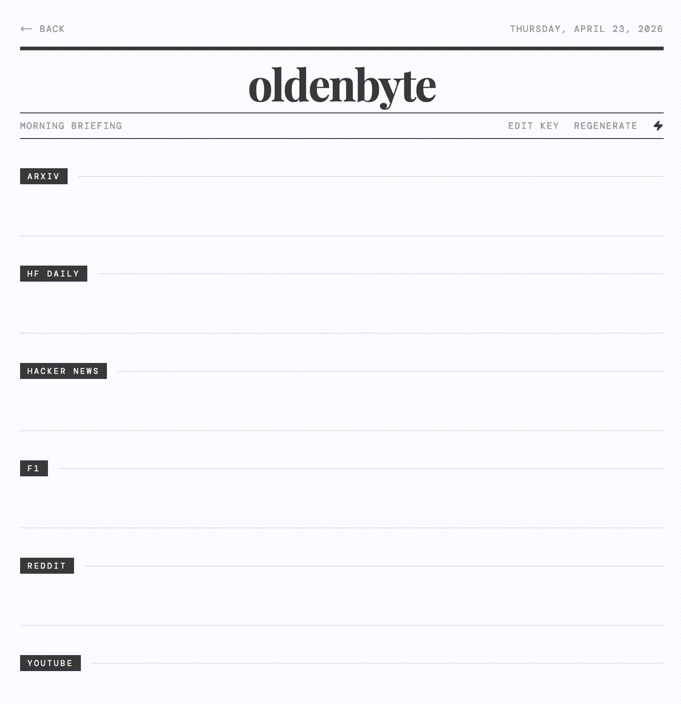

# oldenbyte

A personal dashboard built with Next.js. Widgets are draggable, resizable, and persist their state to a local SQLite database. Responsive for mobile portrait view.


## Widgets

- **Notepad** - a daily notepad with a built-in calendar to browse past entries; multiple instances each get a numbered tab when browsing a past date; renameable
- **Reader** - upload and read PDF or EPUB files, with full-screen view, saved position, and a Kindle-style progress bar
- **Text** - display any static text or a live string fetched from a URL endpoint
- **Feed** - subscribe to any RSS feed, configurable item count, refetches on every page load
- **Reddit** - top posts from one or more subreddits, selectable time period and post count, interleaved across subreddits, refetches on every page load
- **YouTube** - latest videos from one or more channels, sorted newest-first with a "new" badge for uploads under 24 hours, refetches on every page load
- **F1** - next race details with countdown and current top 5 driver standings, updated hourly
- **arXiv** - latest papers from a chosen research field (CS, Math, Physics, and more), with abstract view on click, refetches on every page load
- **HF Daily** - trending AI papers curated by Hugging Face, sorted by upvotes, refetches on every page load

## Morning digest



`/digest` is a separate page that reads today's cached widget data and generates a newspaper-style AI briefing using OpenAI's `gpt-4o-mini`. Each widget section gets its own API call, running in parallel. A streaming mode toggle streams each section's text in real-time as it's generated. The OpenAI API key is stored in `localStorage`. Accessible from the main dashboard via the newspaper icon in the top bar.

## Top bar

The left and right text fields are editable and can display either a static string or a live value fetched from any URL that returns plain text (for example a weather or IP address endpoint). The center shows a configurable date or clock with the action buttons (digest, dark mode, layout edit) grouped below it. Dark mode preference is persisted to the database.

## Stack

- **Next.js 16** with App Router and TypeScript
- **Tailwind CSS v4** for styling
- **Prisma + SQLite** for persistent storage
- **react-grid-layout** for drag and drop widget management
- **react-pdf** and **epubjs** for document rendering

## Development

```bash
npm install
npm run dev
```

The app runs at `http://localhost:3000`. A local SQLite database is created automatically at `data/` on first run.

## Self-hosting with Docker

**1. Create a `.env` file** next to `docker-compose.yml`:

```
DASHBOARD_PASSWORD=your-password
SESSION_SECRET=<random hex string>
```

Generate a secret with:

```bash
openssl rand -hex 32
```

**2. Initialize the data directory:**

```bash
mkdir -p data
touch data/db.sqlite
chmod 666 data/db.sqlite
```

**3. Start the container:**

```bash
docker compose up -d
```

The app is exposed on port `3847`. Data (database and uploaded files) is persisted in `./data/` on the host.

Watchtower is included and polls for new image versions every 5 minutes, pulling and restarting the container automatically when a new build is pushed.

## Credits

- F1 circuit outlines by [Jules Roy](https://github.com/julesr0y/f1-circuits-svg), licensed under [CC BY 4.0](https://creativecommons.org/licenses/by/4.0/)

## Deployment

Pushing to `main` triggers a GitHub Actions workflow that builds and pushes a Docker image to GHCR. Watchtower on the server picks it up automatically.
