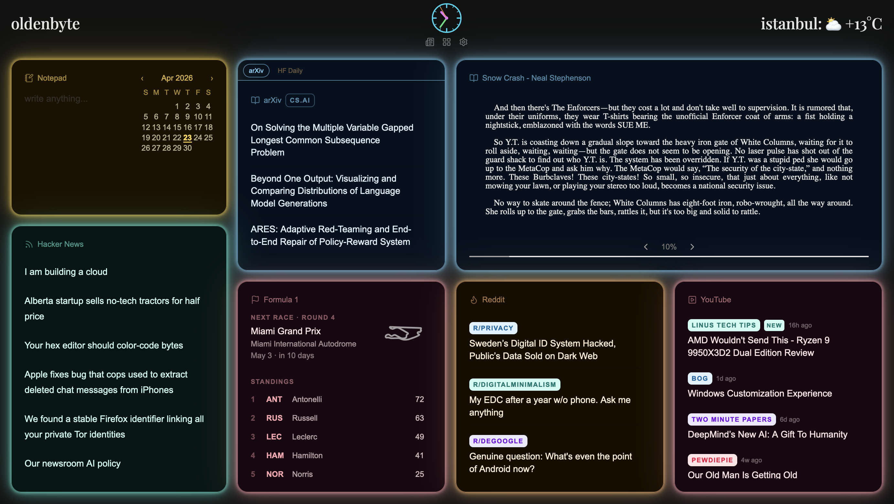

# oldenbyte

A personal dashboard built with Next.js. Widgets are draggable, resizable, and persist their state to a local SQLite database. Responsive for mobile portrait view.

While tools like Glance or Dashy are great read-only status boards, oldenbyte is closer to a personal workspace — the layout is freeform, content is interactive (Reddit posts open inline, EPUBs and PDFs are readable inside the widget), and there's a notepad with full date history.



## Widgets

- **Notepad** - a daily notepad with a built-in calendar to browse past entries
- **Reader** - upload and read PDF or EPUB files, with full-screen view and saved page position
- **Text** - display any text or a live string fetched from a URL
- **Feed** - subscribe to any RSS feed, configurable item count, headlines cached daily
- **Reddit** - top posts from one or more subreddits, selectable time period and post count, interleaved across subreddits with per-subreddit color coding
- **YouTube** - latest videos from one or more channels, resolved by handle or URL, interleaved with relative upload timestamps

## Top bar

The left and right text fields are editable and can display either a static string or a live value fetched from any URL that returns plain text (for example a weather or IP address endpoint). The center shows a configurable date or clock. The layout edit button lives in the top right corner.

## Stack

- **Next.js 16** with App Router and TypeScript
- **Tailwind CSS v4** for styling
- **Prisma + SQLite** for persistent storage
- **react-grid-layout** for drag and drop widget management
- **react-pdf** and **epubjs** for document rendering

## Development

```bash
npm install
npm run dev
```

The app runs at `http://localhost:3000`. A local SQLite database is created automatically at `data/` on first run.

## Self-hosting with Docker

**1. Create a `.env` file** next to `docker-compose.yml`:

```
DASHBOARD_PASSWORD=your-password
SESSION_SECRET=<random hex string>
```

Generate a secret with:

```bash
openssl rand -hex 32
```

**2. Initialize the data directory:**

```bash
mkdir -p data
touch data/db.sqlite
chmod 666 data/db.sqlite
```

**3. Start the container:**

```bash
docker compose up -d
```

The app is exposed on port `3847`. Data (database and uploaded files) is persisted in `./data/` on the host.

Watchtower is included and polls for new image versions every 5 minutes, pulling and restarting the container automatically when a new build is pushed.

## Deployment

Pushing to `main` triggers a GitHub Actions workflow that builds and pushes a Docker image to GHCR. Watchtower on the server picks it up automatically.
